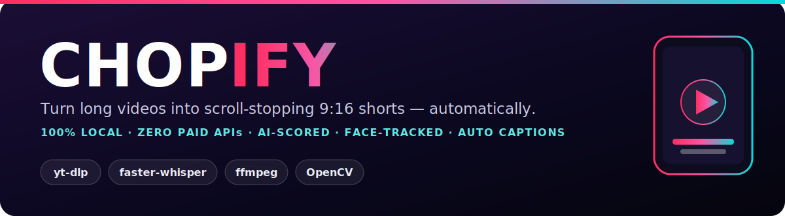

<p align="center">
  
</p>

<p align="center">
  
  
  
  
  
  
</p>

<p align="center"><b>Drop in a YouTube link &#8594; get back scored, vertical, captioned clips &#8212; 100% on your own machine.</b></p>

---

## Demo

<p align="center"></p>

## How it works

<p align="center">
  
</p>

## Features

- **AI virality scoring** &#8212; every segment is rated on hook, shock, humour, controversy, insight, emotion, energy and complete-arc; only **8+/10** clips are kept.
- **Local transcription** &#8212; faster-whisper with word-level timestamps. Nothing leaves your PC.
- **Speaker-tracking 9:16** &#8212; OpenCV (YuNet) auto-reframes to follow whoever is talking, with snap-on-cut and an edge-margin guard so faces never get half-cut.
- **Word-by-word captions** &#8212; bold CapCut style, burnt in with ffmpeg.
- **Zero paid APIs, zero cloud** &#8212; yt-dlp + faster-whisper + ffmpeg + OpenCV.
- **Content decides the count** &#8212; a 1-hour video might yield 2 clips or 20.

## Chopify vs. the paid tools

Chopify does the core of what these subscription products do &#8212; **AI-scored clips, auto-reframe to 9:16, and burnt word-by-word captions** &#8212; except it runs **free, on your own machine, and fully open-source**.

| Product | Pricing | Runs | Open source |
| --- | --- | --- | --- |
| **Chopify** | **Free** | **Local (your PC)** | **MIT** |
| [Opus Clip](https://www.opus.pro) | Paid subscription | Cloud | No |
| [Vizard.ai](https://vizard.ai) | Paid subscription | Cloud | No |
| [Klap](https://klap.app) | Paid subscription | Cloud | No |
| [2Short.ai](https://2short.ai) | Freemium + paid | Cloud | No |
| [Munch](https://www.getmunch.com) | Paid subscription | Cloud | No |
| [Spikes Studio](https://spikes.studio) | Freemium + paid | Cloud | No |
| [Submagic](https://www.submagic.co) | Paid subscription | Cloud | No |
| [SendShort](https://sendshort.ai) | Paid subscription | Cloud | No |

<sub>Independent products and trademarks of their respective owners; pricing and features change over time. Comparison covers the long-video to short-clip workflow only.</sub>

## Requirements

- Windows, Python 3.11+
- `ffmpeg` + `ffprobe` on PATH &#8212; `winget install Gyan.FFmpeg`
- `deno` on PATH (yt-dlp JS-challenge solving) &#8212; `winget install DenoLand.Deno`

## Install

```bash
python -m venv .venv
.venv\Scripts\python -m pip install -r requirements.txt
```

## Usage

**1. Download + transcribe** &#8594; writes `work/transcript.json`:

```bash
.venv\Scripts\python download_and_transcribe.py "<YOUTUBE_URL>"
```

**2. Score** &#8594; write `work/segments.json` with the segments to clip:

```json
{ "start": 134.2, "end": 187.6, "hook": "short title for the filename", "overall": 8.4 }
```

Scoring reads `transcript.json` and rates segments on the eight criteria above. In the
reference setup an LLM agent does this in-loop (zero API cost); score it however you like.

**3. Render** &#8594; cut + 9:16 speaker-tracking crop + burnt captions &#8594; `C:\clips`:

```bash
.venv\Scripts\python render_clips.py work
```

## Notes

- **GPU:** faster-whisper (CTranslate2) is **CUDA / NVIDIA-only**; on AMD it runs on CPU
  (whisper.cpp + Vulkan was attempted for AMD but is unstable on RDNA3 &#8212; crashes or
  returns corrupted output).
- **Captions** use a built-in ffmpeg ASS renderer (the PyPI `pycaps` is an empty stub).
- Output folder is `C:\clips` &#8212; change `OUT_DIR` in `render_clips.py`.

<sub>Personal / educational use &#8212; you are responsible for the rights to any video you process.</sub>